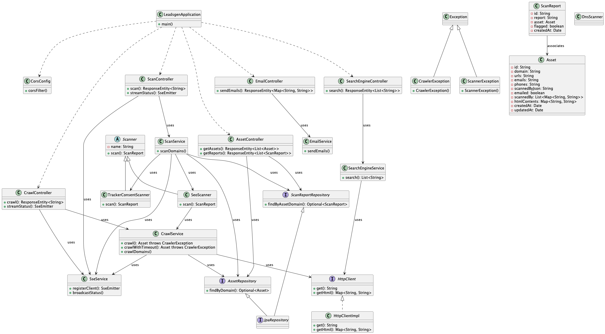

# Website Scanning & Outreach tool
Skanna hemsidor efter vanliga fel, få fram kontaktinformation och skicka mail till ägarna.

## Förklaring av kod
Projektet är designat för att kunna skalas med fler scanners som testar nya saker, sålänge en scanner ärver från `Scanner`-klassen och implementerar metoden `scan()` så kommer den att fungera i applikationen. 

### BDD tester
Dessa testar funktionaliteten från controller-lagret för att spegla användarens perspektiv av applikationen.

### Enhetstester
Dessa testar funktionaliteten mer grundligt genom att testa flera lager av applikationen.

### Modeller

#### Asset
En Asset är en representation av en hemsida som ska scannas. Den innehåller information om hemsidan och dess ägare, samt metadata som när den senast scannades och av vilken scanner.

#### ScanReport
En ScanReport är en representation av en skanning av en hemsida. Den innehåller information om vilka fel som hittades, vilka scanners som användes och vilken *Asset* som skannades.

## Kör applikationen lokalt

### Docker
För att köra applikationen i en Docker-container, kör följande kommandon:

```bash
git clone https://github.com/linx02/website-scanning-tool.git
cd website-scanning-tool
docker-compose up
```

Navigera sedan till `http://localhost:8080` för att se frontend.

## Frontend
Filerna som ligger i resources/static är byggda och exporterade från ett Next.js-projekt.

## Diagram

### Klassdiagram


### Användningsfall
